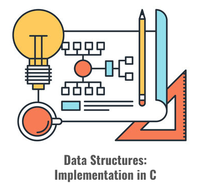

<h1 align="center">
    Data Structures
</h1>

  

  

  

  

    

## Table of Contents

- [Table of Contents](#table-of-contents)
- [Description](#description)
- [Data Structures](#data-structures)
  - [Stack](#stack)
  - [Queue](#queue)
- [How to Use](#how-to-use)
- [How to Contribute](#how-to-contribute)
- [License](#license)

## Description

Implementation of several data structures in C language.

    

## Data Structures

### Stack

Stack is a linear data structure which follows the order LIFO (Last In First Out) to perform the operations. The last element added to the stack is the first to be removed (like a real stack of dishes).

In this repository, there are two different implementations of this data structure:

- Stack: Implementation of a stack using a dynamically allocated array. The capacity of this type of stack is determined in its creation (with the `StackFactory()` function). Because it's implemented using an array, the capacity cannot be changed without memory reallocation. This reallocation can be done with `GrowStack()` function, that creates a new memory allocation with the twice size of the previous and copies the elements of previous stack to this new allocated stack. These operations are costly, so the Chained Stack is a more efficient implementation.

- Chained Stack: Implementation of a stack using several dynamically allocated `Nodes`. The function of the `Stack` struct is only to register the length and the node that are in the top of the stack. Each node of the stack is linked (with memory address pointers) to its previous node. Like a iron chain, where its length can be increased adding more iron links, the length of the Chained Stack can be increased adding more nodes to it (without the need of memory reallocation).

### Queue

Queue is a linear data structure which follows the order FIFO (First In First Out) to perform the operations. The first element added to the stack is the first to be removed (like a real waiting queue of a clinic).

In this repository, there are two different implementations of this data structure:

- Queue: Implementation of a queue using a dynamically allocated array. This implementation used here is also known as "Circular Queue". The capacity of this type of queue is determined in its creation (with the `QueueFactory()` function). Because it's implemented using an array, the capacity cannot be changed without memory reallocation. The operations used to made the reallocation are costly, so the Chained Queue is a better implementation.

- Chained Queue: Implementation of a queue using several dynamically allocated `Nodes`. The function of the `Queue` struct is only to register the length and the nodes that are the head and the tail of the queue. Each node of the queue is linked (with memory address pointers) to its next node. Like a iron chain, where its length can be increased adding more iron links, the length of the Chained Queue can be increased adding more nodes to it (without the need of memory reallocation).

## How To Use

Under construction...

## How to Contribute

To contribute with this project:

- Do a fork of this repository;
- Create a branch with your feature: `git checkout -b my-feature`;
- Commit your changes: `git commit -m 'feat: 'My feature details'`.
- Push the commits to your branch `git push origin my-feature`.

After the merge of your pull request has been made, you can delete your branch.

## License

This project is licensed under the MIT License. See the [license](https://opensource.org/licenses/MIT) page for details.